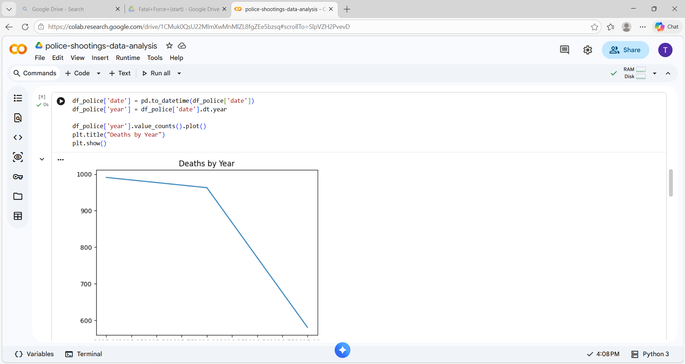
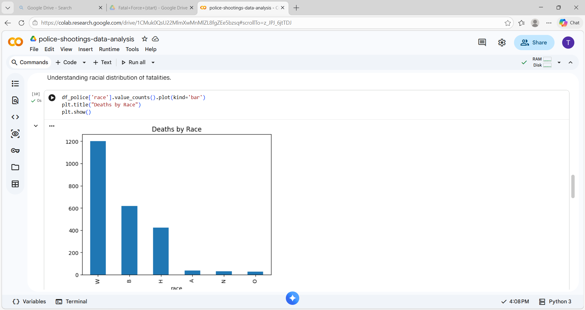

📊 Police Shootings Data Analysis (USA)

📌 Project Overview

This project analyzes police-related deaths in the United States by combining Washington Post data with U.S. Census data. The goal is to explore patterns and understand how socio-economic factors like income, poverty, education, and race relate to police-related fatalities.

🛠️ Tools & Technologies

- Python
- Pandas
- Matplotlib
- Seaborn
- Google Colab

📊 Key Analysis

- Trends in police-related deaths over time
- Distribution of deaths by race
- Relationship between median household income and deaths
- Impact of poverty and education levels on fatalities

📸 Sample Output

🧠 Insights

- Police-related deaths show patterns over time
- Certain demographic groups are more affected
- Socio-economic factors like income and poverty may influence trends
- Data analysis helps in understanding complex social issues

▶️ How to Run

1. Open the notebook in Google Colab
2. Upload all datasets
3. Run cells step by step
4. View visualizations

---

⭐ This project demonstrates data cleaning, merging multiple datasets, and visualizing real-world data using Python.
